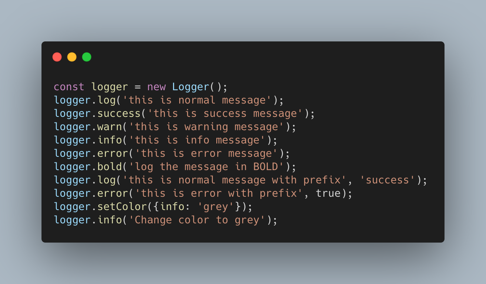
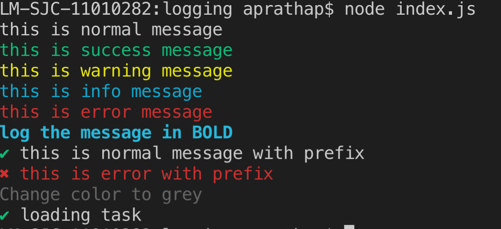

# log-cli
[](https://travis-ci.org/github/pajaydev/log-cli)

A simple logger for node cli, it wraps around chalk and ora package.


## Installation

```shell
npm install log-cli
```
or

```shell
yarn add log-cli
```

## Usage:

```javascript
const Logger = require('log-cli')

const logger = new Logger();
logger.log('this is normal message');
// prints the success message in green color
logger.success('this is success message');
// prints the message with the default prefix
logger.success('this is success message', true);
```

<p align="center">

</p>
<p align="center">

</p>

## Examples
- [click here](https://github.com/pajaydev/log-cli/blob/master/example.js)

## Methods

```
warn, success, error, log, info, bold, spin, spinStart, spinStop
```


### Change the default colors of logging

Default color mapping
```json
{
    "error": "red",
    "info": "cyan",
    "warn": "yellow",
    "success": "green"
}
```

You can override colors using the `setColor` method like below

```javascript
logger.setColor({info: 'grey'});
```

## credits.

 - [Chalk](https://www.npmjs.com/package/chalk)
 - [Ora](https://www.npmjs.com/package/ora)
